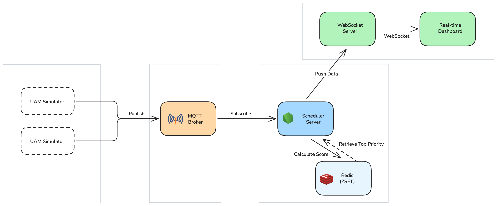

# UAM Density Control 

**Urban Air Mobility(UAM)** 환경에서 다수의 기체와 버티포트(Vertiport) 간의 효율적인 통신 및 우선순위 기반의 착륙 스케줄링을 시뮬레이션하는 프로젝트입니다.

## Overview

이 프로젝트는 초당 수천 개의 메시지가 발생하는 고밀도 UAM 환경을 가정합니다. 기체의 배터리 상태, 비상 여부 등을 실시간으로 계산하여 최적의 착륙 순서를 결정하고, 이를 관제 대시보드와 연동하여 실제 기체에 명령을 하달하는 **Full-stack Control System**을 지향합니다.

## Architecture

**5-Layer Architecture**

1. **L1 (UAM Simulator):** 다수의 가상 기체가 MQTT를 통해 실시간 상태(배터리, 좌표, 비상 상태)를 송신합니다.
2. **L2 (MQTT Broker):** 대량의 기체 메시지를 수집하는 입구 역할을 하며, 고가용성을 보장합니다.
3. **L3 (Scheduler Engine):**
* **Priority Calculation:** 기체의 상태 정보를 기반으로 우선순위 점수를 계산합니다.
* **Redis ZSET Buffer:** 계산된 점수를 Redis의 Sorted Set에 저장하여 실시간으로 정렬합니다. 이는 브라우저의 과부하를 방지하기 위한 **Backpressure 제어 및 완충 댐** 역할을 합니다.


4. **L4 (Visualization & Control):**
* **WebSocket:** 정렬된 최상위 우선순위 데이터를 실시간으로 대시보드에 스트리밍합니다.
* **Feedback Loop:** 관제사가 대시보드에서 하달한 명령(착륙 승인 등)이 스케줄러를 거쳐 다시 기체로 전달되는 양방향 핸드셰이크를 구현합니다.

5. **L5 (Persistence):** 통계 분석을 위해 모든 로그 데이터를 **Time-series DB**에 비동기적으로 저장합니다.

## Tech Stack

* **Language:** TypeScript (NestJS)
* **Message Broker:** Mosquitto (MQTT)
* **In-Memory DB:** Redis (Sorted Set for Real-time Ranking)
* **Communication:** WebSocket, gRPC, mTLS
* **Frontend:** React, shadcn/ui (Dashboard)
* **Database:** TimescaleDB (Time-series)

## Key Features

* **Priority-Based Scheduling:** 단순 선입선출(FIFO)이 아닌, 에너지 잔량 및 응급도를 고려한 지능형 스케줄링.
* **Data Throttling:** Redis ZSET을 이용해 초당 수천 개의 데이터를 브라우저가 처리 가능한 수준으로 최적화하여 렌더링 성능 확보.
* **Secure Handshake:** mTLS 및 gRPC를 활용한 기체-관제 서버 간 보안 통신 프로토콜 설계.
* **Real-time Feedback:** 관제 명령이 기체 시뮬레이터의 동작에 즉각 반영되는 인터랙티브 루프.

## App Details

```
uam-density-control/
├── apps/
│   ├── simulator/      # NestJS (MQTT Client)
│   ├── gateway/        # NestJS (MQTT Broker Interface)
│   ├── scheduler/      # NestJS (Redis ZSET, Logic)
│   └── dashboard/      # React + shadcn/ui
├── packages/
│   ├── proto/          # gRPC 정의 (.proto 파일 및 생성된 TS 코드)
│   ├── types/          # 기체 상태(Status), 우선순위 DTO 등 공통 타입
│   ├── database/       # TimescaleDB (Prisma/TypeORM) 스키마 및 클라이언트
│   ├── ui/             # 공통 컴포넌트 (shadcn/ui 기반)
│   └── config/         # ESLint, Prettier, TSConfig 공통 설정
├── turbo.json          # Turborepo 빌드 파이프라인 설정
├── pnpm-workspace.yaml # pnpm 워크스페이스 정의
└── docker-compose.yml  # 전체 인프라(Mosquitto, Redis, DB) 실행
```

- [simulator/README.md](apps/simulator/README.md)
- [gateway/README.md](apps/gateway/README.md)
- [scheduler/README.md](apps/scheduler/README.md)
- [dashboard/README.md](apps/dashboard/README.md)

